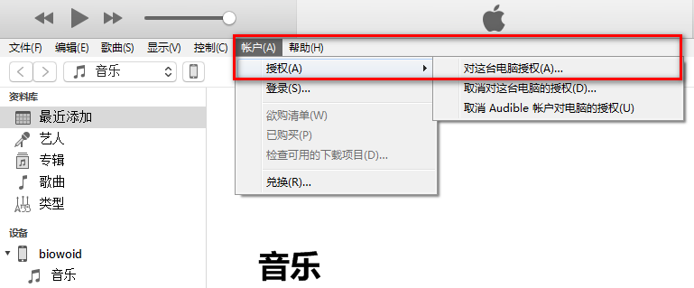
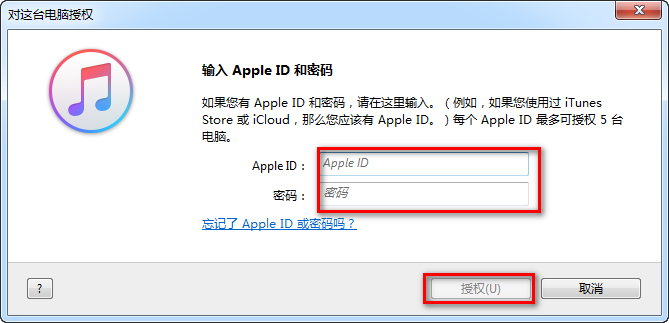
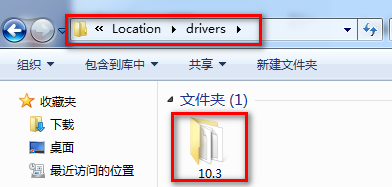
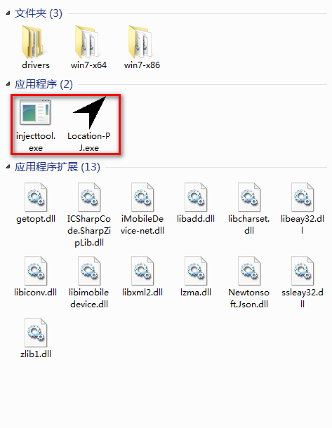
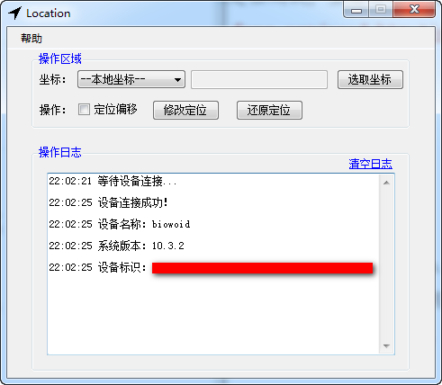
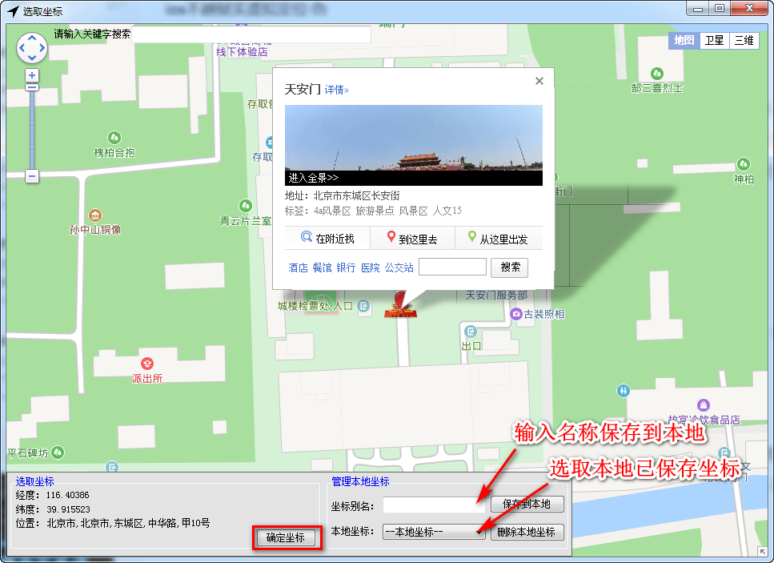
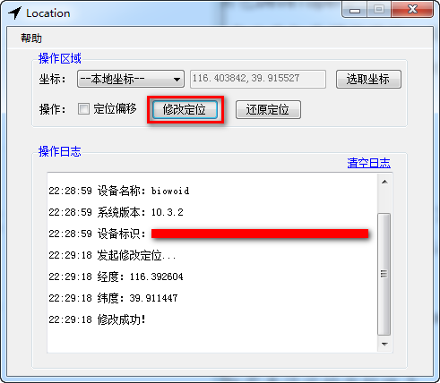
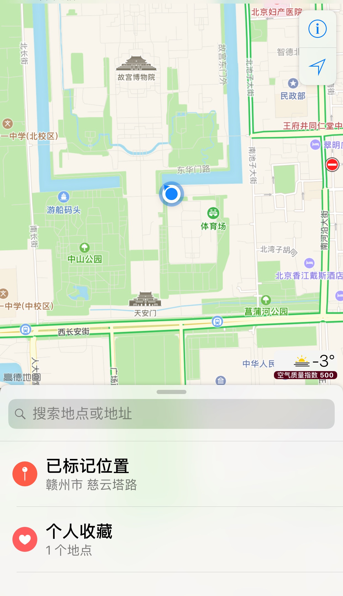
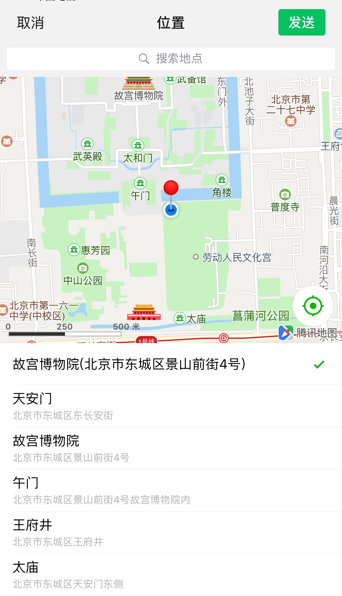

## ios不越狱实虚拟定位Ⅰ·伪 ##
根据网上帖子进行虚拟定位测试，主要目的是获得限定礼装（失败）。

原贴地址：[https://bbs.feng.com/read-htm-tid-11844218.html](https://bbs.feng.com/read-htm-tid-11844218.html "原文地址")（膜拜大佬）

### 测试环境 ###
ios10.3.2

### 必备软件 ###
iTunes
[https://www.apple.com/cn/itunes/download/](https://www.apple.com/cn/itunes/download/)

location-PJ
[https://bbs.feng.com/read-htm-tid-11844218.html](https://bbs.feng.com/read-htm-tid-11844218.html)

DeveloperDiskImage.dmg
[https://bbs.feng.com/read-htm-tid-11844218.html](https://bbs.feng.com/read-htm-tid-11844218.html)

### 原理 ###
location-PJ向开发者工具包DeveloperDiskImage.dmg写入地理坐标，再将开发者工具包导入手机，因为开发者工具包是调试用的，具有系统优先权限，所以系统就会使用Developer的地理坐标，忽略GPS坐标。重启手机，Developer就会自动删除，没有任何影响。

### 操作步骤 ###
1. 打开iTunes，用数据线将手机和电脑连接（第一次需要对电脑进行授权），关闭iTunes；
# 
# 
2. 将对应版本的开发者工具包压缩包解压至location文件夹内的drivers目录下；
# 
3. 点击运行location-PJ.exe（第一次运行location-PJ.exe前，先运行injecttool.exe），出现如下信息表示连接成功；
# 
# 
4. 点击选择坐标，鼠标选取需要设定的坐标地点，然后点击确定坐标（如果以后要还需用到此坐标，可以输入名称，保存到本地，以后可以从本地坐标下拉菜单项里直接选择），再点击修改定位；
# 
# 
5. 查看手机自带地图及微信定位，确认位置（实际位置有偏差，大范围不变）；
#  

### 可能遇到的问题及解决方法 ###
1. location-PJ.exe打不开（目前没遇到）；

	解决方法：下载安装 .NET Framework 4.5.2

	[https://www.microsoft.com/en-us/download/confirmation.aspx?id=42642](https://www.microsoft.com/en-us/download/confirmation.aspx?id=42642)
2. location-PJ.exe打开提示有关api-ms-win-crt-runtime-l1-1-0.dll或弹出丢失VCRUNTIME140.dll的错误信息；

	解决方法：下载 vc_redist.x86.exe安装（因为程序依赖这个，和系统多少位无关）

	[https://www.microsoft.com/zh-cn/download/details.aspx?id=48145](https://www.microsoft.com/zh-cn/download/details.aspx?id=48145)

### 总结 ###
所以我的目的还不是没达到，这种设定能欺骗系统本身（发现系统时间快了一小时的瞬间，我惊了一下，不过马上反应到时差的问题），也能欺骗部分app（至少微信是这样），那为啥不能瞒过fgo嘞！想了想不成功的原因，有两种猜想：

1. app无视了Developer坐标，直接采用真实GPS坐标（说好的系统优先权限呢）；
2. app接受了Developer坐标，但是判别机制可能是原生IP+GPS限定（如果是这样就很棘手，至少目前条件不足没法解决）；
